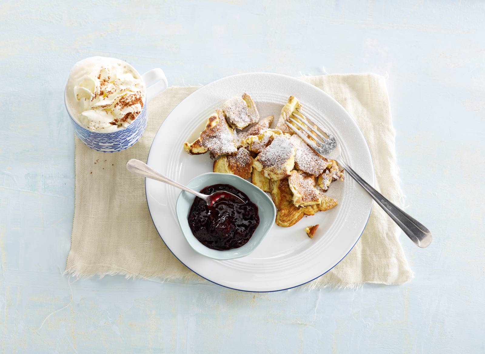

# Kaiserschmarrn

## Benodigdheden
25 minuten bereiden   
voor **4** personen:
* een mixer
* 4 middelgrote eieren
* 50g kristalsuicker
* 100g tarwebloem
* 100ml volle melk
* 40g ongezouten roomboter
* 2g poedersuiker
* 100g kersenjam in pot

### Bereiding
1. Splits de eieren. Klop de eidooiers en suiker met een mixer in een kom licht en romig. Bewaar  
   de eiwitten. Zeef de bloem erboven en klop met de melk tot een glad beslag. Klop de  
   eiwitten in een vetvrije kom stijf en spatel in delen door het beslag.  

2. Verhit de boter in 2 koekenpannen op laag vuur en verdeel het beslag over de pannen. Bak 3  
   min. Snijd de pannenkoeken in vieren en ker de kwarten om met behulp van een spatel.  
   Verdeel nu met de spatel de kwarten kleinere stukjes. Bak nog 3 min. en keer regelmatig.  

3. Bestuif de kaiserschmarrn met de poedersuiker en serveer met de jam.

## Voedingswaarden  
**(eenpersoonsportie)**

Energie:                 360kcal  
***  
Koolhydraten:            47 g  
***  
Natrium:                 95 mg  
***  
Eiwit:                   11 g  
***  
Vet:                     14 g  
Waarvan verzadigd:       8 g  
***  
Vezels:                  1 g  

  
recept van [AlbertHein](https://www.ah.nl/allerhande/recept/R-R1185295/kaiserschmarrn)